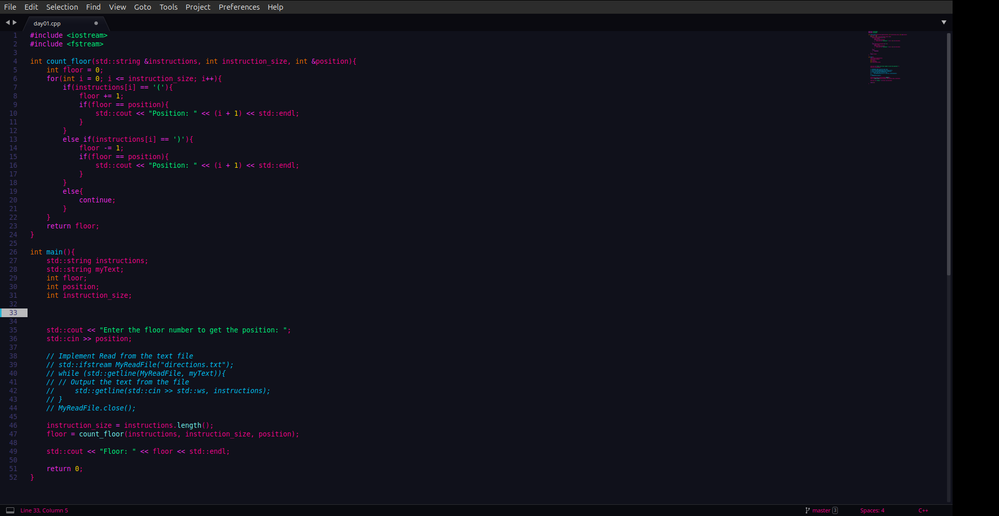
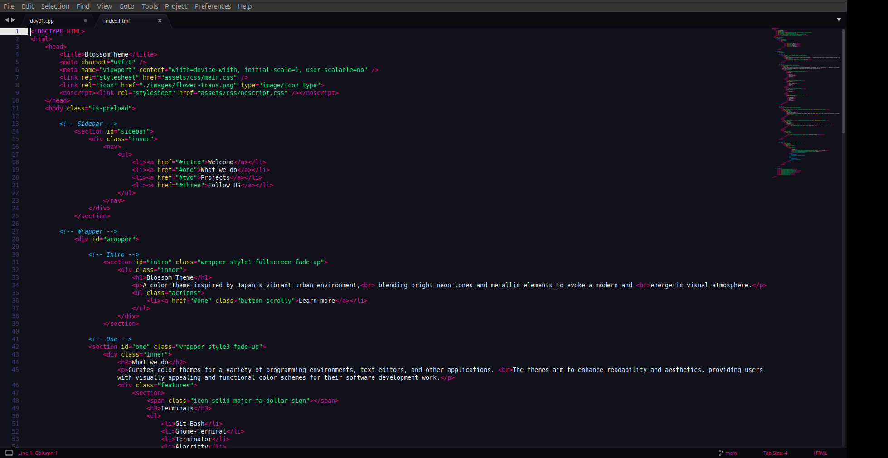
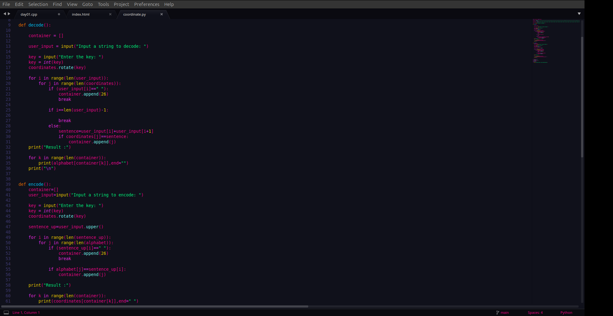

# Blossom Theme for Sublime-Text

## Preview

## Installation 
### Install manually

    - Download using the GitHub .zip download option or using git.
    - Unzip the files and rename the folder to BlossomTheme.
    - Find your Packages directory using the menu item Preferences -> Browse Packages.
    - Copy the folder into your Sublime Text Packages directory.

### Activating theme

- Go to Preferences -> Color Scheme -> User and select the Blossom Color Scheme.
- Go to preference -> Theme -> And select the Blossom Theme
